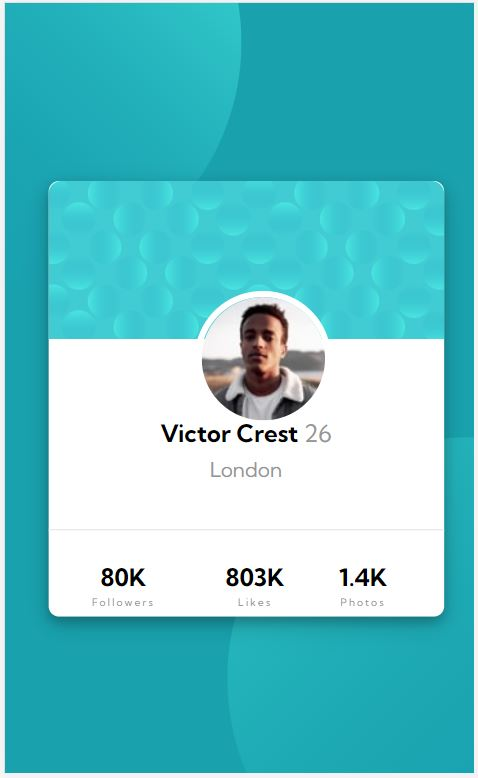

# Frontend Mentor - Profile card component solution

This is a solution to the [Profile card component challenge on Frontend Mentor](https://www.frontendmentor.io/challenges/profile-card-component-cfArpWshJ). Frontend Mentor challenges help you improve your coding skills by building realistic projects. 

## Table of contents

- [Overview](#overview)
  - [The challenge](#the-challenge)
  - [Screenshot](#screenshot)
  - [Links](#links)
  - [Built with](#built-with)
  - [Useful resources](#useful-resources)
- [Author](#author)

## Overview

### The challenge

- Build out the project to the designs provided  in the "Profile card component"

### Screenshot

### Links

- Live Site URL: [live site URL](https://neetigarg.github.io/ProfileCard/)

### Built with

- HTML5
- CSS3 

### Useful resources

- https://developer.mozilla.org/en-US/docs/Web/CSS/CSS_Positioning/Understanding_z_index/The_stacking_context - This article helped me to have a better understanding of position and z-index
- https://stackoverflow.com/questions/39736537/how-do-i-center-a-div-in-the-middle-of-the-page-even-if-i-change-the-window-siz - This page helped to place the div in the center

## Author

- Website - [Neeti Garg](https://www.your-site.com)
- Frontend Mentor - [@neetigarg](https://www.frontendmentor.io/profile/yourusername)
